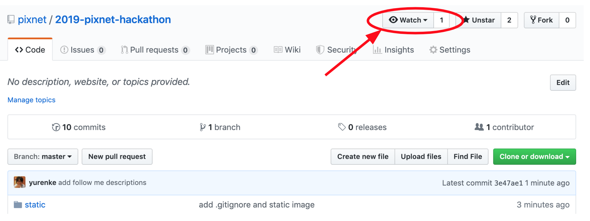

### 想報名 but 缺咖嗎？ 快進來組隊 👉 [組隊大平台](https://lihi1.cc/af7aW/github)
### HERE! 新增 [競賽資源專區](./RESOURCE.md)
### HERE! 搶鮮體驗 [API](./api/README.md)
### HERE! 搶鮮觀看 [Raw Data 資料格式](./data/README.md)
### 關注以獲取更新訊息 [更新紀錄](./CHANGELOG.md)

<h1 align="center"><a href="https://lihi.cc/06nzQ/github">第六屆 PIXNET HACKATHON</a></h1>
<h2 align="center">Taiwan Browser 翻轉在地體驗</h2>
<h3 align="center"><a href="https://lihi.cc/06nzQ/github">快來報名 🏃</a></h3>

## 活動網址

官網近期上線

## 活動簡介

台灣，這片我們生活的土地，有著豐富的人文風情、歷史建築、特色料理、自然景觀等多元魅力，值得一一深入探索。「科技」讓「旅行」有了更豐富的面貌，不只提供更加個人化、在地化、即時便捷的服務，更可能帶來嶄新的感官體驗。 
 
PIXNET 每年黑客松賽事不僅呼應最新科技趨勢，也重視技術的落地應用。2019 年第六屆 PIXNET HACKATHON 聚焦旅遊科技（Travel tech）在台灣的應用，將提供痞客邦網站巨量資料、API，以及 HotelsCombined 商業數據，期待各界優秀技術團隊運用創意，發揮資料更大應用價值！

## 你應該參加的理由
### 多元資料隨你玩
【本屆資料類別及特色】

* 內容資料庫：痞客邦龐大的旅遊美食文章是旅途規劃的最佳指南，資料庫包含文章標籤、文章關聯關鍵字（TF-IDF），結合圖片辨識技術、餐廳 POI，可成為意圖分析、語意分析、推薦系統的絕佳訓練資料庫。
* 網站瀏覽行為：提供去識別化的訪客、會員每日超過千萬次的瀏覽行為紀錄，包含來源國家城市、使用裝置、文章內點擊行為⋯⋯等，也包含 PIXNET 研發中心以機器學習判斷的訪客性別、年齡，利於洞悉使用者輪廓、瀏覽歷程以及閱讀習慣。
* 商務導流數據：本屆賽事 PIXNET 特別與 HotelsCombined 合作，提供商務導流點擊、訂單數量等商業數據，可了解使用者的消費意圖以及轉換成效，期待各界技術高手善加運用。
* 網路搜尋行為：痞客邦乘載了龐大的內容，吸引每日數百萬使用者造訪，其中有超過六成來自 Google 搜尋引擎，透過痞客邦 Google Search Console 資料，可從宏觀角度分析使用者的意圖與需求，以及哪些內容最受大眾青睞。

### 創意及技術力展現舞台
本屆與 HotelsCombined 合作，優秀團隊將有機會和其洽談後續合作，或者是PIXNET工作機會。 
期許各界高手發揮創意，能夠運用多元數據，打造令人驚豔的作品。

### 技術交流工作坊
賽前將舉辦工作坊，邀請學界及業界，有旅遊相關產品開發及研究的專家進行分享。歡迎有意參賽或有興趣者免費報名參加！ 
<h3 ><a href="https://lihi.cc/NCscM/github">報名工作坊</a></h3>

## 活動資訊
### 報名方式
無特別條件限制，歡迎對於本屆競賽主題感興趣的高手自行組隊（每隊限制人數為3~5人），每位成員皆需在 2019/7/10 (三) 前至 KKTIX 平台填寫報名資料。主辦單位保留參賽資格審查權利，2019/7/12 (五) 收到 PIXNET 寄發之錄取通知的隊伍，方具本屆參賽資格。

### 活動洽詢
歡迎來信 pixnethacker@pixnet.tw

### 賽事時程
* KKTIX 報名：2019/6/6 (四) 至 2019/7/10（三）
* 初賽錄取通知：2019/7/12（五）
* 初賽繳件期限：2019/8/26（一）
* 決賽錄取公布：2019/8/30（五）
* 決賽繳件期限：2019/9/18（三）
* 決賽簡報＆頒獎典禮：2019/9/21（六）

### 作品方向及型式
參賽隊伍需開發 Web、App 或其他形式的服務，讓旅行者能夠更便捷或者深度探索台灣、體驗台灣，作品方向舉例如下：

- **促進旅遊社群**：開創新的社群模式，讓旅行者能夠更便捷聚集同好、互動交流。
- **智慧行程規劃**：透過各方數據資料整合，提供符合個人需求的旅遊行程安排。
- **解決旅遊痛點**：以科技改善旅途中可能遭遇的各式不便、滿足相關需求。
- **翻轉感官體驗**：利用 VR、AR 等技術，提供旅行者嶄新且更深刻的旅遊體驗。

### 初賽辦法
2019/7/12（五）主辦單位寄發的初賽資格錄取通知 email 中，將提供參賽隊伍本屆資料包下載連結。

作品運用的資料來源需<strong>至少包含一項主辦單位所提供之痞客邦或 HotelsCombined 數據資料、API</strong>，開發出可供操作的作品模型，並於2019/8/26（一）前繳件，評審將依照下列評選標準，擇優進入決賽。主辦單位將於繳件期限前一週通知參賽隊伍檔案上傳位置、實體作品寄送處。

繳件項目需包含下列三項：

- **作品企劃簡報**：介紹作品的構想、解決方案、主要技術或演算法、使用哪些主辦單位/合作單位提供的資料、API，企劃書格式為 Google Slide。
- **作品示範影片**：影片中示範作品的功能、操作方式，影片格式為 mp4 或 mov，影片長度3分鐘內。
- **可操作的作品模型或實體**：提供服務網址或 App 下載點，或郵寄作品實體。

初賽評選標準：

* **主題構想 (30%)**：是否符合賽事主軸、創新概念、構想的完整度
* **解決方案 (30%)**：是否能清楚定義要解決的問題、提出解決方案、作品運用之技術、演算法
* **作品內容 (40%)**：作品 prototype 的功能、可行性、易用性等

### 決賽辦法

決賽前繳交作品及簡報，決賽當天至活動現場，每隊上台簡報並展示作品。

繳件日期：2019/9/18（三）

繳件項目需包含下列兩項：

* **完成作品**：服務網址或 App 載點，或郵寄作品實體。
* **決賽簡報**：提供決賽當天使用之簡報檔案，簡報格式為 Google Slide。

決賽日期：2019/9/21（六）9:00 報到。

決賽地點：位於台北市，將於近期公佈。

決賽評選標準：

### 競賽資源
#### [競賽資源專區](./RESOURCE.md)

### 注意事項

1. 參加者於參加本活動之同時，即同意接受本活動之活動辦法與注意事項之規範，如有違反，主/協辦單位得取消其參加或得獎資格，並就因此所生之損害，得向參加者請求損害賠償。

2. 參賽隊伍所提供之隊伍資訊（包括但不限於隊伍名稱等）、作品題目與內容，不得侵害他人之智慧財產權或其他權利，同時不可涉及廣告、宗教、種族、政黨、暴力或違反社會善良風俗、公共秩序等。

3. 採用不正當之行為（如：侵入資料庫、改封包，及其它經主辦單位認定之駭客行為等）、竄改票數或給予票數者，主辦單位有權終止參賽資格或取消得獎資格，且主辦單位不因此承擔任何責任。

4. 本活動若徵求參加者提供圖文、照片、影片及其他資料等內容予主/協辦單位，參加者同意下列事項：參加者保證提供予本活動之圖文、照片、影片及其他資料，並無侵害他人權利（包括但不限於智慧財產權、人格權、肖像權及隱私權等）或違反法令之情事。如有違反之虞，主/協辦單位得立即移除相關內容，並取消參加者之參加資格，得獎者取消得獎資格，參加者並應自負法律責任。

5. 若主/協辦單位因使用參加者所提供之圖文、照片、影片及其他資料遭第三人請求、索賠、提出民、刑事訴訟或主張任何法律上之權利，參加者應賠償 主/協辦單位因此所生之全部損失與費用(包括但不限於訴訟費、律師費)。

6. 主/協辦單位對參加者所提供之圖文、照片、影片及其他資料有審查權，若不符合本活動之規定，經查證屬實，得取消其參加與得獎資格。

7. 參加者同意授權主/協辦單位於符合本活動目的的情形下，使用及節錄其為參加本活動所提供之圖文、照片、影片及其他資料，做成活動記錄以及宣傳使用。

8. 參加者同意主／協辦單位得於本活動進行過程中，拍攝包含參賽者肖像、聲音之相片、影音做為紀錄、宣傳推廣本活動之用，並得將前述之相片、影音刊登於平面或數位媒體。

9. 凡經報名參賽，參加者即同意主辦單位得為紀錄、宣傳推廣或其他與本活動相關之目的而使用參賽隊伍之作品及參加者相關資料（包括但不限於參加者之姓名、肖像等），主辦單位無須另行通知參加者或支付任何權利金。如涉及作品內容完整呈現者，主辦單位於使用時應註明參賽隊伍名稱或其成員姓名。

10. 各隊作品之智慧財產權屬參賽隊伍之成員所有，參賽隊伍應自行處理與其權利相關之申請或註冊程序。

11. 如有任何因電腦、網路、電話、技術或不可歸責於主/協辦單位之事由，而使參加者所寄出或登錄之資料有遲延、遺失、錯誤、無法辨識或毀損之情況，主/協辦單位不負任何法律責任，參加者亦不得因此異議或要求主辦單位賠償損害。

12. 主辦單位保有更改活動形式、提供資料內容以及活動相關細節的權利。如因不可抗力之特殊原因無法執行時，主辦單位有權決定取消、終止、修改或暫停本活動。

13. 若使用PIXNET API，皆需遵守PIXNET API使用條款。 詳如連結：http://developer.pixnet.pro/#!/doc/pixnetApiTos/pixnetApiTos

14. 本活動所提供之贈品、獎狀、獎盃等活動相關製作物，主辦單位恕不負保管及重新製作之責任。

15. 依稅法規定，得獎者若為中華民國境內居住之個人，所得獎項價值超過新臺幣1,000元（含）以上20,000元以下時，本公司將開立所得稅扣繳憑單予得獎者，如所得獎項價值為20,000元(含)以上時，得獎者需先繳交 10% 預扣所得稅金，始可領獎，本公司亦將開立所得稅扣繳憑單予得獎者。得獎者若為非中華民國境內居住之個人(即在中華民國境內居住未達183天之本國人及外國人)，不論得獎獎項價值，均須先就得獎所得扣繳20％預扣所得稅金，始可領獎，且本公司須開立所得稅扣繳憑單。若未能依法繳納應繳稅額，即視為喪失得獎資格。

16. 為確保獎項發送程序，參賽者應確認登錄資料均為正確完整，如因資料不完全、冒用他人身分或其他違反本活動報名規定事項者，本公司得取消參賽者之參賽資格或得獎資格，參賽者不得異議。

17. 個資法條款

    a. 為提供本活動相關服務，並確保參賽者權益，將遵循個人資料保護法及相關法令之規定，蒐集、處理及利用參賽者所提供之個人資料，包括 E-mail、姓名、性別、出生年月日、身分證字號、服務機構、通訊住址、電話等資訊。

    b. 參賽者就其個人資料得依個人資料保護法第三條之規定，行使：查詢或請求閱覽、請求製給複製本、補充或更正、停止蒐集、處理、利用與刪除等權利。

    c. 參賽者得自由選擇是否提供個人資料或行使個人資料保護法第三條所定之權利，但如提供資料不足或有其他冒用、盜用、不實之情形，參賽者可能因此無法參加本活動及影響各項相關服務或權益。

    d. 參賽者就其個人資料依個人資料保護法第三條之規定，請求停止蒐集、處理或利用或請求刪除前，主辦單位得依循個人資料保護法及相關法令之規定，於個人資料提供之範圍與目的內使用該等個人資料。

<h3 align="center"><a href="https://lihi.cc/06nzQ/github">報名頁面 🏃</a></h3>
