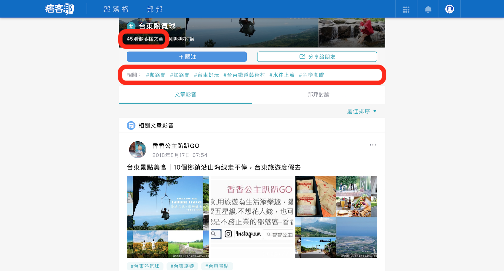

## API 懶人包
### [PIXNET API 首頁](https://developer.pixnet.pro/#!/)
> 使用前請先閱讀 [注意事項](http://developer.pixnet.pro/#!/doc/pixnetApiTos/pixnetApiTos)

### 趕快來用 API

| API 名稱 | 文件位置 | API 範例 |
| - | - | - |
| 文章搜尋 | [文件](https://developer.pixnet.pro/#!/doc/pixnetApi/blogArticlesSearch) | [範例](https://emma.pixnet.cc/blog/articles/search?format=json&type=tag&key=%E5%8F%B0%E6%9D%B1%E7%86%B1%E6%B0%A3%E7%90%83) |
| 文章關鍵字 | [文件](https://developer.pixnet.pro/#!/doc/pixnetApi/blogArticlesIdKeywords) | [範例](https://emma.pixnet.cc/blog/articles/46738528/keywords?format=json&user=admin) |
| 標籤關注 | [文件](https://developer.pixnet.pro/#!/doc/pixnetApi/tagFollow) | [範例](https://emma.pixnet.cc/tag/follow?name=%E5%8F%B0%E6%9D%B1%E7%86%B1%E6%B0%A3%E7%90%83) |

### 使用情境教學

此頁面為 PIXNET 最新推出 - [Tag 集結頁](https://www.pixnet.net/tags/%E5%8F%B0%E6%9D%B1%E7%86%B1%E6%B0%A3%E7%90%83) 之畫面

| 我想拿到 | 使用 API | 使用參數 | 範例 |
| - | - | - | - |
| 有 _台東熱氣球_ 標籤的文章 | [文章搜尋](https://developer.pixnet.pro/#!/doc/pixnetApi/blogArticlesSearch) | `type=tag` `key=台東熱氣球` | [範例](https://emma.pixnet.cc/blog/articles/search?format=json&key=%E5%8F%B0%E6%9D%B1%E7%86%B1%E6%B0%A3%E7%90%83&type=tag) |
| 此頁面其中一篇文章內容的關鍵字 | [文章關鍵字](https://developer.pixnet.pro/#!/doc/pixnetApi/blogArticlesIdKeywords) | `id=66852561` `user=abcjcba` | [範例](https://emma.pixnet.cc/blog/articles/66852561/keywords?user=abcjcba) |
| 與 _台東熱氣球_ 相關的標籤 | Not Yet! | 敬請期待 | |
| _台東熱氣球_ 有多少人關注 | [標籤關注](https://developer.pixnet.pro/#!/doc/pixnetApi/tagFollow) | `name=台東熱氣球` | [範例](https://emma.pixnet.cc/tag/follow?format=json&name=%E5%8F%B0%E6%9D%B1%E7%86%B1%E6%B0%A3%E7%90%83) |

### 再給我幾天 API

| API 名稱 | 說明 |
| - | - |
| POI 店家 | Point of Interest， 透過經緯度獲得美食店家資訊 |
| 關鍵字相關關鍵字 | 提供與該關鍵字高度相關的關鍵字， 如：上面的 `相關標籤`|
| 自動補齊 | 補齊期望內容， Ex: `台 = [台東, 台灣, 台北]` |
